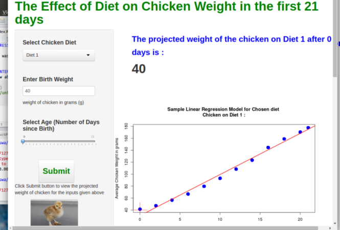
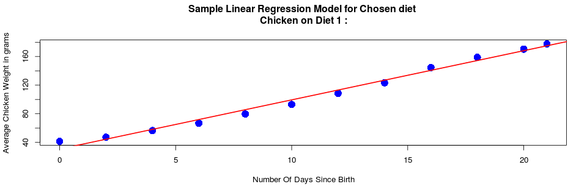

## INTRODUCTION

  * The rate of growth for chicks can depend on the diet they are     given.
  
  * In this presentations, we report on a simple  application that could be used to calculate the projected weight of a chick given the age (number of days since birth)
  
  * The applications can be used to :
    + Calculate the projected weight given the age
    + Compare the  growth rate of the chickens for  the different growth rates
  
  * The application was develop in RStudio using  the   **shiny** package

  * The calculations performed by the applications are based on a *linear regression model* build from an experimental dataset **ChickWeight** which is distributed with R version 3.1.2 

--- .class #id 
## THE APPLICATION INTERFACE



You can run the application from **http://eldube.shinyapps.io/project-App**

---
## THE DATA USED IN BUILDING THE REGRESSION MODEL

```r
data(ChickWeight)
```
* The regression model used in the application was built from the  **ChickWeight**  dataset which has 578 observations and 4 variables. The first three observations are:


```
##   weight Time Chick Diet
## 1     42    0     1    1
## 2     51    2     1    1
## 3     59    4     1    1
```

* The chicks were divided in into four diet groups and the weight of each chick was recorded from day 0 (birth) to day 20, at 2 day intervals. A final recording was made on day 21.

* A regression model for each diet (sample shown in next slide) can be build using the average weight at each recorded time interval.

---
## SAMPLE REGRESSION MODEL


```r
source ("assets/helpers.R") #source code available from 
diet <- 1
data <- ChickWeight
model <-  getDietModel(ChickData = data, dietchoice = diet)
```


```r
plotDietModel(ChickData = data, dietchoice = diet, x=0, y=0)
```

 
